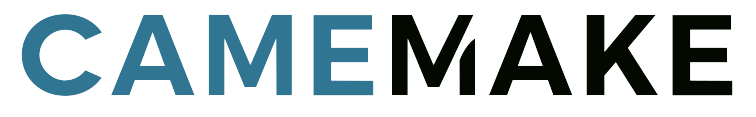

<p align="center">
  
</p>

<h1 align="center">CameVision EGO</h1>

<p align="center">
  <strong>CV-EGO01-OS</strong> · Dual global-shutter AI stereo camera<br>
  Open stereo vision platform for SLAM, robotics, VIO and spatial AI
</p>

<p align="center">
  <a href="https://www.camemake.eu/shop/cv-ego01-os-camevision-ego-dual-global-shutter-ai-stereo-camera-2414"><strong>Buy CameVision EGO</strong></a>
  ·
  <a href="https://www.camemake.eu/robotic-solutions"><strong>Camemake robotic solutions</strong></a>
  ·
  <a href="https://camemake.github.io/CameVision-Ego/"><strong>Product page</strong></a>
  ·
  <a href="https://www.camemake.eu">camemake.eu</a>
</p>

---

**CameVision EGO** is a Camemake product: two hardware-synchronised 2.3 MP global-shutter cameras, one IMU per camera, an on-board vision processor with NPU, USB, Wi-Fi 6, BLE, eMMC and battery support — in one compact board.

This repository is the **open demo software** that ships with the product. Stereo matching, depth, calibration and the live page all run **on the camera**. The host only deploys over USB and opens a browser.

OEM / ODM variants (single, triple, 5-fold and 9-camera PCBs, plus headset, cap, helmet, backpack and gripper products) are documented on the [Camemake robotic solutions](https://www.camemake.eu/robotic-solutions) page.

## Product

| | CameVision EGO · CV-EGO01-OS |
|---|---|
| Cameras | 2 × 2.3 MP global shutter, hardware-synchronised stereo |
| IMU | 2 × IMU, one at each camera |
| Compute | On-board vision SoC with integrated NPU |
| Memory | 1 GB RAM |
| Storage | 16 GB eMMC + microSD slot |
| Wired | USB (developer / ADB gadget) · USB-C |
| Wireless | Wi-Fi 6 + BLE |
| Power | USB-C and battery pads |
| Software | This GitHub demo (on-board stereo, calibration, IMU HUD) |
| Applications | SLAM, VIO, robotics, egocentric and spatial AI |

Evaluation pricing and volume breaks are on the [webshop listing](https://www.camemake.eu/shop/cv-ego01-os-camevision-ego-dual-global-shutter-ai-stereo-camera-2414) (MOQ 10). For brand-label boards, custom baseline, housing or volume, contact [sales@camemake.com](mailto:sales@camemake.com).

Hardware revision in this tree: **CameVision Ego V1.I1**.

## What this software does

- Live stereo page at `http://127.0.0.1:8081/`
- Checkerboard calibration at `http://127.0.0.1:8081/cal`
- IMU HUD at `http://127.0.0.1:8083/` (also `/imu` on the stereo page)
- Hardware frame sync (FSYNC / EFSYNC) so both eyes expose together
- 50 Hz lighting lock (Europe mains) with 12.5 fps trigger, 20 ms exposure steps
- On-board block matcher, 640×400 depth grid, jet heatmap
- Display: left pane is CAM1 / IMU1, right pane is CAM0 / IMU0
- Service starts on the board at boot; USB stays the Camemake developer gadget (ADB)

## Quick start

1. Power the CameVision EGO and connect USB-C to the PC.
2. From this repository:

```
python tools/cv_ego_stereo_start.py
python tools/cv_ego_autostart.py --install
```

3. Open **http://127.0.0.1:8081/**

`--install` adds a Windows logon helper. After that, plugging the camera deploys the overlay if needed, starts the page service, restores the USB port forwards, and opens the live view.

| Command | Use |
|---|---|
| `python tools/cv_ego_stereo_start.py` | First-time or full overlay push |
| `python tools/cv_ego_autostart.py --install` | Always-on plug-in helper (once per PC) |
| `python tools/cv_ego_page.py` | Forwards only, then open the page |
| `restore/release-1-20260824/restore-release1.ps1` | Same as the two Python commands above |

USB port forwards live on the PC and are dropped on unplug. That is why the helper exists. The stereo process itself already starts on the camera at boot (`S99ego-stereo` → `/userdata/camevision-stereo.sh`).

### Live routes

| URL | Content |
|---|---|
| `/` | Stereo live page (CAM1 left, CAM0 right, depth) |
| `/cal` | Checkerboard calibration |
| `/ov0` `/ov1` | Colour MJPEG, CAM0 / CAM1 |
| `/depth` `/xyz` | Depth heatmap |
| `/imu` | IMU HUD (also port 8083) |

Do not invert the depth CSS (`scale(-1,-1)` is the correct view).

## Release 1 (baseline)

Path: [`restore/release-1-20260824`](restore/release-1-20260824). Notes: [`RELEASE.md`](restore/release-1-20260824/RELEASE.md).

This is the software overlay to keep. It does **not** reflash boot, rootfs or oem. Python wheels stay on the camera at `/userdata/pylib`.

**Proven on CameVision EGO**

- Dual colour ISP (AWB / CCM / gamma). Auto-exposure reattaches if a grab restart drops it
- Both eyes triggered together at **12.5 fps**, aligned to 50 Hz lighting
- Exposure locked on **20 ms** steps
- On-board SGBM depth, 640×400, jet heatmap
- Calibration page and IMU HUD left running

Board notes and GPIO map: [`EGO.md`](EGO.md).

## Repository layout

```
tools/                          Host deploy and on-board sources
  ego_stereo.py                 Live stereo, depth, calibration HTTP
  ego_cam_sync.py               Hardware FSYNC / EFSYNC
  ego_imu_hud.py                IMU HUD
  ego_calib.html                Calibration UI
  camevision-stereo.sh          Board boot start
  S99ego-stereo                 Init unit (installs to /etc/init.d)
  cv_ego_stereo_start.py        Push overlay and start
  cv_ego_autostart.py           PC watcher: deploy + forwards + page
  cv_ego_page.py                Forwards only
  stereo_native.c               Native matcher
device-tree/                    CameVision Ego board tree
restore/release-1-20260824/     Current baseline overlay
restore/recovery-5-*/           Dual-camera imaging restore (boot)
```

## Hardware notes (this board)

CameVision Ego V1.I1 carries two global-shutter imagers at 1920×1200, four MIPI lanes per eye, and one IMU beside each camera.

| Eye | CSI | Control | Power-down | Sync | Trigger | IMU |
|---|---|---|---|---|---|---|
| CAM0 | CSI RX0, 4-lane | I2C3 `@0x30` | GPIO4_A3 | GPIO4_A1 → FSYNC | GPIO6_C2 → EFSYNC | SPI0 |
| CAM1 | CSI RX1, 4-lane | I2C-GPIO `@0x30` | GPIO4_A2 | GPIO4_A0 → FSYNC | GPIO6_C3 → EFSYNC | SPI1 |

CAM1 I2C SCL/SDA are swapped on the PCB versus the SoC I2C4 functions, so that eye is bit-banged. CSI RX1 uses the 4-lane PHY on that port (not the 2-lane split of CSI0).

Trigger mode is **continuous** on both sensors. Slave-mode HDR bits stay off so the 3A stack still owns exposure. Trigger rate is 12.5 fps; programmed VTS remains 15. Do not reuse CAM1 power-down or I2C pins as sync outputs.

Fitted memory is **1 GB** DDR (the schematic 512 MB label is wrong). Both IMUs are the same part. eMMC is `BWCTAK611G16G`.

## Camemake robotic family

CameVision EGO is the **dual-camera** board in the CameVision family. The same platform is offered as ODM PCBs and finished goods:

| Cameras on the PCB | Role |
|---|---|
| 1 | Monocular / tool camera |
| **2 (EGO)** | Hardware-synced stereo — this product |
| 3 | Stereo plus a context camera |
| 5 | Timed array (wearable / backpack) |
| 9 | Near-surround workplace capture |

Finished ODM products on the same family include a stereo headset, cap, PPE helmet, 5-fold array with backpack, and a handheld teaching gripper.

Read the family, ODM / OEM paths and Camemake Lens (Shenzhen R&D) on **[Camemake robotic solutions](https://www.camemake.eu/robotic-solutions)**.

Every Camemake camera module can be tailored — sensor, lens, housing, interface and firmware. Request a quote from the [shop page](https://www.camemake.eu/shop/cv-ego01-os-camevision-ego-dual-global-shutter-ai-stereo-camera-2414) or email [sales@camemake.com](mailto:sales@camemake.com).

## Documentation

| Page | What it covers |
|---|---|
| [Product page](https://camemake.github.io/CameVision-Ego/) | Public GitHub Pages site for this product |
| [Get started](https://camemake.github.io/CameVision-Ego/start.html) | Install, live routes, Release 1 |
| [Hardware](https://camemake.github.io/CameVision-Ego/hardware.html) | Camera map, GPIO, fitted parts |
| [Robotic family](https://camemake.github.io/CameVision-Ego/family.html) | CameVision PCB counts and ODM products |
| [`EGO.md`](EGO.md) | Full board notes |
| [`RELEASE.md`](restore/release-1-20260824/RELEASE.md) | Release 1 overlay |

## FAQ

**Does the PC compute stereo?** No. Matching, depth and calibration run on the CameVision EGO. The host only deploys files and opens the browser.

**Why does the page disappear after unplug?** USB port forwards live on the PC. Install `python tools/cv_ego_autostart.py --install` once so they return on every plug.

**Where do I buy boards or ask for ODM?** The [webshop listing](https://www.camemake.eu/shop/cv-ego01-os-camevision-ego-dual-global-shutter-ai-stereo-camera-2414) and [Camemake robotic solutions](https://www.camemake.eu/robotic-solutions). Email [sales@camemake.com](mailto:sales@camemake.com).

## Support

- Product and orders: [camemake.eu](https://www.camemake.eu) · [sales@camemake.com](mailto:sales@camemake.com)
- This repository is the open demo for **CameVision EGO** only. 

© Camemake. CameVision EGO · CV-EGO01-OS.
